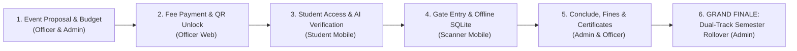
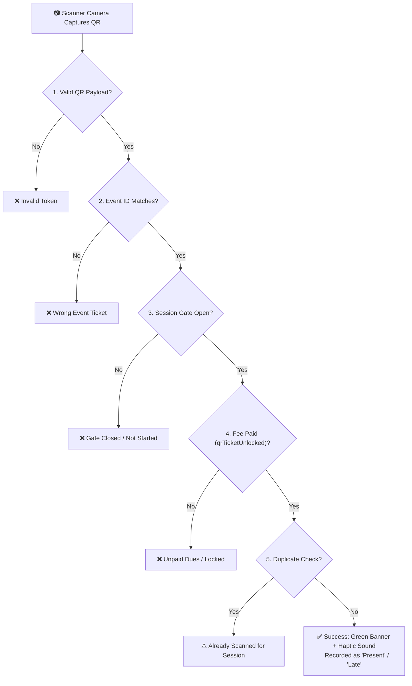

# STI Sync — End-to-End System Flow & Defense Presentation Guide

> **Target Audience:** Thesis / Capstone Defense Panel, System Evaluators, Project Advisers, and QA Testers  
> **System:** STI Sync Web & Mobile Integrated Campus Platform  
> **Architecture:** React 19 + TypeScript Web Admin/Officer Portal · Flutter Mobile App · Firebase Firestore · Drift SQLite Offline Engine · Google Gemini Vision AI  

---

## Table of Contents
1. [Executive Defense Strategy & Demo Timeline](#1-executive-defense-strategy--demo-timeline)
2. [Pre-Defense Checklist & Actor Accounts](#2-pre-defense-checklist--actor-accounts)
3. [The Date & Time Demonstration Strategy (Zero-Bug Protocol)](#3-the-date--time-demonstration-strategy-zero-bug-protocol)
4. [Phase 1: SAO / SAS Administrator Web Flow](#4-phase-1-sao--sas-administrator-web-flow)
5. [Phase 2: Organization Officer Web Flow](#5-phase-2-organization-officer-web-flow)
6. [Phase 3: Student Mobile App Flow (AI & Digital ID)](#6-phase-3-student-mobile-app-flow-ai--digital-id)
7. [Phase 4: Mobile Scanner Officer Flow (Online & Offline SQLite)](#7-phase-4-mobile-scanner-officer-flow-online--offline-sqlite)
8. [Phase 5: Event Conclusion, Fines & Certificates](#8-phase-5-event-conclusion-fines--certificates)
9. [Phase 6: The Grand Finale — Dual-Track Academic Rollover](#9-phase-6-the-grand-finale--dual-track-academic-rollover)
10. [Master Panel Q&A Cheat Sheet](#10-master-panel-qa-cheat-sheet)

---

## 1. Executive Defense Strategy & Demo Timeline

Presenting a dual-platform system (Web + Mobile) with automated AI and offline database synchronization can be overwhelming if not strictly structured. The best approach is to present **chronologically through an event's natural lifecycle**:



### Recommended 18-Minute Defense Presentation Schedule

| Time Window | Persona / Role | Core Capability Demonstrated | Key WOW Factor |
| :--- | :--- | :--- | :--- |
| **00:00 – 03:00** | 🧑‍💻 **Officer & Admin (Web)** | Event Proposal Submission & Line-Item Budget Audit | Real-time proposal approval & budget validation |
| **03:00 – 05:30** | 🧑‍💻 **Officer (Web)** | Event Fee Collection & Cash Receipt Recording | Instant payment unlock of student QR tickets |
| **05:30 – 08:30** | 🎓 **Student (Mobile)** | Multi-Agent AI Student ID Verification & Digital Student ID | Instant AI auto-approval vs. discrepancy rejection |
| **08:30 – 13:00** | 📱 **Scanner (Mobile)** | Live QR Gate Validation, Session Grace Periods & 100% Offline Scanning | **Turning on Airplane Mode** & scanning with SQLite |
| **13:00 – 15:30** | 🧑‍💼 **Admin / Officer** | Offline SQLite-to-Cloud Sync, Event Conclusion & Certificates | Automated absentee fines & certificate issuance |
| **15:30 – 18:00** | 🧑‍💼 **SAO Admin (Web)** | **THE FINALE: Dual-Track Academic Rollover & Governance** | Live semester transition without student lockouts |

---

## 2. Pre-Defense Checklist & Actor Accounts

Prepare these 4 accounts ahead of time in your browser and mobile test device:

| Role | Username / Email | Password | Role Purpose in Demo |
| :--- | :--- | :--- | :--- |
| **SAO Admin** | `sao.admin@ormoc.sti.edu.ph` | *(Your admin pass)* | Web Admin approvals, academic terms, institutional audit |
| **Org Officer** | `jpcs.president@ormoc.sti.edu.ph` | *(Your officer pass)* | Club event creation, cash fee collection, liquidations |
| **Student 1 (Existing)** | `lei.concordia@gmail.com` | *(Your student pass)* | Active College BSIT student holding an eligible QR ticket |
| **Student 2 (Fresh Demo)**| `demo.student@gmail.com` | *(Fresh account)* | Used to demonstrate live AI registration on camera |
| **Scanner Officer** | `scanner.officer@gmail.com` | *(Scanner pass)* | Assigned scanner user for mobile gate scanning |

### Hardware & Environment Setup
1. **Screen Mirroring**: Use Scrcpy, Anydesk, or Vysor to mirror your Android physical phone to the presentation projector.
2. **Web Browser Tabs**: Keep two browser windows open:
   - Window 1: Chrome (SAO Admin Portal logged in at `http://localhost:5173/home/dashboard`)
   - Window 2: Edge or Incognito (Officer Portal logged in at `http://localhost:5173/officer/dashboard`)
3. **Mobile Device**: Ensure mobile Wi-Fi is connected, Camera permission is granted, and app is running.

---

## 3. The Date & Time Demonstration Strategy (Zero-Bug Protocol)

> [!WARNING]
> **Why Date & Time Breaks Demos If Not Handled Properly:**  
> When students manually roll back Android system clocks to match an old event date, **Firebase Auth tokens expire, SSL certificates fail (HTTPS rejects the connection), and Cloudinary rejects uploads due to timestamp skew**.  
> **Follow our zero-bug protocol below to show all session states without breaking system security.**

### Solution 1: Live Event Synchronization (Recommended for Main Demo)
Instead of modifying your phone's clock, **set the demo event's session time to the current clock time of your presentation!**

*If your defense starts at 2:00 PM, create or edit your demo event session as follows:*
- **Event Date**: `TODAY's Date` (e.g., `2026-09-28`)
- **Session Start Time**: `1:55 PM` (5 minutes before now)
- **Grace Period**: `15 minutes` (Valid on-time until `2:10 PM`)
- **Late Threshold / Time-In Close**: `45 minutes` (Accepts late check-in until `2:40 PM`)
- **Time-Out Open**: `2:15 PM` to `3:00 PM`
- **Result**: You are guaranteed a working, open gate during your live scan demonstration with zero clock changes!

---

### Solution 2: The "4-Phase Session Demonstration" Matrix

If the panel asks: *"How do we know the system actually locks early students, marks latecomers, and closes when time expires?"*, present this exact matrix:

| Test Scenario | How to Set Session in Web App | What Scanner Displays | Expected Scan Output |
| :--- | :--- | :--- | :--- |
| **1. Early Gate Lockout** | Set `startTime` to **20 minutes in the FUTURE** (e.g. `2:40 PM`) | Orange Badge: `Opens at 2:40 PM`. Gate locked. | **Blocked**: Scanner denies entry. *"Gate window has not started yet."* |
| **2. On-Time Check-In** | Set `startTime` to **5 mins AGO** with `gracePeriod = 15m` | Green Badge: `Open (On-Time)`. | **Success**: Green flash, *"Verified — Present"*. Record logged as `Present`. |
| **3. Grace Period Expired (Late)** | Set `startTime` to **30 mins AGO** with `gracePeriod = 15m` | Amber Badge: `Open (Late Threshold)`. | **Warning**: Amber flash, *"Verified — Late"*. Record logged as `Late`. Late sanction queued. |
| **4. Gate Closed (Cutoff)** | Set `startTime` to **2 hours AGO** with `lateThreshold = 60m` | Red Badge: `Closed at 1:00 PM`. Gate locked. | **Rejected**: Red flash, *"Attendance window has closed for this session."* |
| **5. Time-Out Scan** | Set `hasTimeOut = true`, switch gate toggle to `Time-Out (Exit)` | Blue/Green Badge: `Open for checkout`. | **Success**: Blue confirmation, *"Check-Out Recorded"*. Complete attendance verified. |

---

### Solution 3: The Android Phone Clock Override (If Panel Demands Manual Testing)
If the panel insists on seeing the mobile app respond to device clock changes live:
1. Open Android **Settings > System > Date & Time**.
2. Toggle **OFF** `Set time automatically`.
3. Advance the clock forward by **30 minutes** (simulating late arrival) or **2 hours** (simulating gate closure).
4. Switch back to STI Sync Scanner screen: Notice the gate status banner dynamically updates from `Open` to `Closed`!
5. **CRITICAL RESET PROTOCOL (UNDO IMMEDIATELY):**
   - Go right back to **Settings > System > Date & Time**.
   - Toggle **ON** `Set time automatically`.
   - Toggle **ON** `Set time zone automatically`.
   - Return to the app. (This prevents Firebase SSL and network synchronization issues).

---

## 4. Phase 1: SAO / SAS Administrator Web Flow

Start your presentation on the **Web Admin Portal**. This proves to the panel that the platform enforces institutional authority before any club or student can act.

```
Web Route: http://localhost:5173/home/dashboard
Actor: SAO / SAS Head Administrator
```

### Step 1.1: Dual-Track Academic Term Overview (Baseline Setup)
- **Where to navigate**: `/home/academic` (Academic Terms)
- **What to explain to the panel**:
  > *"STI College operates under a dual-track academic structure: College uses a 2-Semester system, while Senior High School operates under a 3-Trimester system. Notice that our baseline currently has College in 1st Semester and SHS in 1st Trimester. We will keep these active for our event demonstrations and perform a live institutional rollover as our Grand Finale."*
- **Live Action**:
  1. Show the current active College Semester: `1st Semester · A.Y. 2026-2027`.
  2. Show the current active SHS Trimester: `1st Trimester · A.Y. 2026-2027`.
  3. Show the active status badges and explain that all upcoming event validations check against these active terms.
- **Validations Enforced**:
  - Exactly one active term per academic level allowed at a time.
  - Term dates cannot overlap with existing historical terms.
- **Expected Output**: Active badges display with green indicator; all connected clients listen via Firestore streams.

### Step 1.2: Student Registry & Multi-Agent AI Audit Inspection
- **Where to navigate**: `/home/student-approvals` or `/home/students`
- **What to explain to the panel**:
  > *"Admins do not need to manually review thousands of student registrations. Our Google Gemini Vision AI multi-agent service verifies documents automatically. However, the Admin maintains complete audit authority over flagged cases."*
- **Live Action**:
  1. Click on a student marked **`ACTIVE`** (Auto-approved by AI):
     - Show the **Revision History** modal: `reviewedBy: "AI_VERIFICATION"`, `status: "ACTIVE"`, confidence score: `94%`.
  2. Click on a student marked **`RETURNED`** (Flagged by AI):
     - Show the exact AI reason: *"Name on school document does not match your registered name."*
  3. Demonstrate Admin Override: Click **Manual Approve** to show that SAO staff can override false positives if necessary.
- **Validations Enforced**:
  - Non-STI IDs and name mismatches are automatically filtered out.
  - Every review action is permanently stamped with reviewer UID, timestamp, and revision counter.
- **Expected Output**: Student status transitions in real time without refreshing the web browser.

### Step 1.3: Event Proposal Review & Budget Authorization
- **Where to navigate**: `/home/event-approvals`
- **Live Action**:
  1. Open a club proposal submitted by JPCS: `"IT Congress 2026"`.
  2. Inspect the **Line-Item Budget**:
     - Item: `"Sound System Rental"` — ₱3,500
     - Item: `"Guest Speaker Token"` — ₱2,000
     - Total Requested: ₱5,500.
  3. Inspect **Payable & Fee Configuration**:
     - Student Fee: ₱150.00.
     - Mandatory Attendance: `Yes`.
     - Target Cohort: `College - BSIT, BSCS (All Years)`.
  4. Click **Approve Proposal**.
- **Validations Enforced**:
  - Cannot approve an event without at least one defined session and valid date.
  - Total approved budget cannot exceed organization's remaining institutional balance.
- **Expected Output**: Event status updates from `pending_review` to `approved`. Event document in Firestore updates, instantly making it visible on the student mobile app.

### Step 1.4: Scanner Assignment & Secure Gate Activation Code
- **Where to navigate**: `/home/scanner-assignments`
- **Live Action**:
  1. Select the approved event `"IT Congress 2026"`.
  2. Assign an officer as official scanner: `Scanner Officer (JPCS Auditor)`.
  3. View the **Activation Code** generated: e.g., `SCAN-7821`.
- **Expected Output**: The assigned officer's mobile app receives gate access credentials. Unauthorized students cannot access scanner mode.

---

## 5. Phase 2: Organization Officer Web Flow

Switch to the **Officer Portal** (or show Officer view) to demonstrate student club autonomy and financial liquidation.

```
Web Route: http://localhost:5173/officer/dashboard
Actor: Student Organization President / Treasurer (e.g. JPCS)
```

### Step 2.1: Club Event Proposal Submission
- **Where to navigate**: `/officer/events/create`
- **Live Action (Walkthrough with Panel)**:
  1. Fill Event Details:
     - Title: `"Web Development Bootcamp 2026"`
     - Format: `On-Campus` | Venue: `STI Gymnasium`
  2. Configure Session Timing (The Defense Safe Setup):
     - Date: `Today's Date`
     - Start Time: `Current Time - 5 mins`
     - End Time: `Current Time + 2 hours`
     - Check `Has Time-Out Scan`: `Yes`
     - Grace Period: `15 mins` | Late Threshold: `45 mins`
  3. Configure Fees & Budget:
     - Student Fee: ₱50.00
     - Enable QR Tickets: `Checked`
  4. Submit to SAS: Status changes to `pending_review`.
- **Validations Enforced**:
  - End time must be strictly after Start time.
  - Target audience must have at least one department and year level selected.
- **Expected Output**: Proposal submitted with automatic notification to SAO Admin queue.

### Step 2.2: Fee Collection & Real-Time QR Gate Unlock
- **Where to navigate**: `/officer/payables` or `/officer/events/{id}/payments`
- **What to explain to the panel**:
  > *"When an event has an assigned fee, the student's mobile QR ticket is automatically locked. As soon as the club treasurer receives cash payment and marks it paid on this dashboard, the student's mobile QR code unlocks in real time without refreshing."*
- **Live Action**:
  1. Locate student `Lei Concordia` in the payables list: Status = `Unpaid` (₱50.00 due).
  2. Show Student's Mobile Screen: The QR Ticket screen displays a **Locked Card with Amber Lock Badge** stating *"Event Fee Unpaid — ₱50.00"*.
  3. On Web Officer Portal: Click **Record Payment**:
     - Payment Method: `Cash`
     - Amount Received: `₱50.00`
     - Receipt No: `OR-2026-0042`
     - Click **Confirm Payment**.
  4. **The WOW Moment**: Point at the mobile screen. Within 1 second, the mobile card dynamically flips, revealing the **Bright Verified QR Code**!
- **Validations Enforced**:
  - Cannot record payment amount greater than remaining balance due.
  - Payment record creates an immutable transaction sub-entry with treasurer UID.
- **Expected Output**: Mobile app receives Firestore stream update; locked overlay dismisses automatically.

---

## 6. Phase 3: Student Mobile App Flow (AI & Digital ID)

Transition presentation attention to the **Mobile Application** (mirrored on screen).

```
Mobile App: STI Sync Student App
Actor: Enrolled Student (Lei Concordia / New Student)
```

### Step 3.1: Multi-Agent AI Registration Demonstration
- **Scenario A: Discrepancy Detection (The Security Test)**
  1. On Mobile, open **Register**.
  2. Fill Name: `"Lei Concordia"` | Student ID: `02000123456`.
  3. Upload an ID photo with a mismatched name (or an unrelated image).
  4. Take a selfie and tap **Submit Registration**.
  5. **Expected Output**:
     - App shows progress: *Uploading photo (35%) -> Uploading ID (55%) -> Running AI Verification (75%)*.
     - AI evaluates document: Detects name mismatch.
     - Screen updates to: **"Account Returned for Revision"** with red warning:
       > *"Name on school document does not match your registered name. Please upload your own official STI ID."*
     - Account is safely held in `RETURNED` status; no unauthorized access granted.

- **Scenario B: Instant AI Auto-Approval (The Convenience Test)**
  1. Re-upload with matching STI ID and clear selfie.
  2. Tap **Submit**.
  3. **Expected Output**:
     - AI detects STI College header, matching full name, and valid selfie face.
     - Status set to **`ACTIVE`** (`confidence: 0.95`).
     - App transitions immediately to the **Dashboard Screen** with full student access.

### Step 3.2: Digital Student ID Card
- **Where to look**: Top of Dashboard (`DigitalIdCard`)
- **Live Action**:
  1. Show student details: Full Name, 11-digit Student ID, Program (`BSIT`), and Year Level (`2nd Year`).
  2. Show dynamic **Academic Period Badge**: Displays dedicated cohort term (`1st Semester · A.Y. 2026-2027`).
  3. Tap **Flip Card**: Card flips smoothly to reveal the official student barcode and student information back.
  4. Tap **ID Photo**: Enlarge photo modal with verified badge.

### Step 3.3: Event Discovery & Cohort Filtering
- **Where to look**: Dashboard > Upcoming Events / Events Tab
- **What to explain to the panel**:
  > *"Events respect academic hierarchy. A Senior High School seminar is never shown to College students unless explicitly cross-departmental."*
- **Live Action**:
  1. Show event list: Displays `"IT Congress 2026"`.
  2. Tap into Event Details:
     - Shows event banner, date, venue, objectives, and schedule breakdown.
     - Displays session list with Start, Grace, and End times.

### Step 3.4: Dynamic QR Entry Ticket & Offline Caching
- **Where to look**: Bottom Navigation > **My QR Ticket**
- **Live Action**:
  1. View the unlocked ticket for `"IT Congress 2026"`.
  2. Point out security elements:
     - High-contrast QR code generated from encrypted student UID + Event reference.
     - Real-time pulsating status indicator.
     - Live countdown to session start.
  3. **The Offline Test**:
     - Turn **OFF** Wi-Fi and Mobile Data on the student's phone.
     - Close the app and re-open it.
     - Navigate to My QR: The ticket renders immediately from local **Drift SQLite cache** with an *"Offline Mode — Cached Ticket"* badge!

---

## 7. Phase 4: Mobile Scanner Officer Flow (Online & Offline SQLite)

This is the technical highlight of the defense. Demonstrate how gate security operates even during a complete campus network blackout.

```
Mobile App: STI Sync Scanner Mode
Actor: Designated Student Scanner Officer
```

### Step 4.1: Entering Scanner Mode & Downloading Event Package
1. On Officer's phone, open **Profile > Scanner Mode** (or enter via activation code `SCAN-7821`).
2. Select the assigned event: `"IT Congress 2026"`.
3. Tap **Download Event Offline Package**:
   - The app queries Firestore and saves all eligible participants, payment statuses, and session timings into local **Drift SQLite database tables** (`local_events`, `local_participants`, `local_payables`).
   - Progress reaches 100%: *"Ready for Offline Scanning (320 participants cached)"*.

### Step 4.2: Session & Gate Selection
1. Tap **Select Session**:
   - Displays Session 1: `"Morning Keynote & Plenary"`.
   - Gate Selector: Toggle between **Time-In (Entry)** and **Time-Out (Exit)**.
2. The `SessionTimingEvaluator` evaluates current time:
   - Displays badge: `Open (On-Time)` or `Open (Late Threshold)`.
3. Tap **Start Camera Scanner**.

### Step 4.3: The 6-Stage Gate Scan Pipeline (Live Scan Demo)
Hold the Scanner camera up to Student 1's mobile QR ticket.



- **Live Output on Scanner**:
  - Heavy haptic vibration + pleasant chime sound.
  - Full-screen green overlay:
    * Student Name: `Lei Concordia`
    * Student ID: `02000123456`
    * Status: `VERIFIED — PRESENT`
    * Timestamp: `2:04:18 PM`
- **Duplicate Prevention Test**:
  - Point camera at the same QR code again immediately.
  - **Output**: Amber overlay with alert sound: *"Duplicate Scan: Already scanned at 2:04 PM for this session."*

### Step 4.4: The 100% Offline Blackout Demonstration (THE WOW MOMENT)
1. Tell the panel:
   > *"In campus events with thousands of students, cellular signals fail and Wi-Fi crashes. We will now disconnect all internet connectivity to prove STI Sync works completely offline."*
2. **Turn ON Airplane Mode** on the Scanner Phone (No Wi-Fi, No Cellular).
3. Scan Student 2's QR ticket.
4. **Expected Output**:
   - The scanner validates the ticket in **under 80 milliseconds** using the local Drift SQLite database!
   - Green confirmation displays: *"Verified (Offline Cached)"*.
   - Scanner dashboard updates: `Pending Sync Queue: 1 scan`.
5. Scan a manual / walk-in student using **Manual Attendance** tab (search student by ID `02000123457` and tap check-in).
   - Local DB records manual check-in: `Pending Sync Queue: 2 scans`.

### Step 4.5: Offline-to-Cloud Drift Synchronization
1. Turn **OFF Airplane Mode** (reconnect Wi-Fi).
2. Tap **Sync Now** (or watch background auto-sync trigger).
3. **Expected Output**:
   - The app streams local SQLite attendance rows up to Firebase Firestore `/attendance` collection using batch transactions.
   - Sync progress reaches 100%: *"All 2 offline records synced successfully."*
4. Switch to Web Admin Portal: The live attendance log instantly shows both scans with exact timestamps!

---

## 8. Phase 5: Event Conclusion, Fines & Certificates

Demonstrate post-event processing and accountability.

```
Web Route: http://localhost:5173/home/events/{id}
Actor: SAO Admin / Event Organizer
```

### Step 5.1: Conclude Event & Audit Attendance
1. Click **Conclude Event Modal**.
2. System displays attendance summary:
   - Enrolled: `50 students`
   - Present: `42 students` (84%)
   - Absent: `8 students` (16%)

### Step 5.2: Automated Absentee Fine Generation
1. Check option: **"Generate Sanctions for Unexcused Absentees"**.
2. Set fine amount: `₱50.00` (Org Fine / Non-Attendance).
3. Click **Finalize & Conclude**.
4. **Expected Output**:
   - Event status changes to `completed`.
   - Firestore automatically creates new records in `/payables` for all 8 absent students.
   - On Absent Student's Mobile App: Navigating to **Payables** reveals a new entry: *"Absence Fine — IT Congress 2026 (₱50.00)"*.

### Step 5.3: Automated Digital Certificate Issuance
1. On Web Portal, navigate to **Certificates**.
2. Select Certificate Template: `"Certificate of Participation"`.
3. Filter: `Minimum 75% Attendance`.
4. Click **Issue Certificates to 42 Eligible Attendees**.
5. **Expected Output**:
   - Background service creates verified records in `/issued_certificates`.
   - On Attendee Student's Mobile App: A push notification/badge appears in **Certificates**.
   - Student taps certificate: A high-resolution PDF certificate renders with the student's name, event title, digital signature, and verification QR code.

---

## 9. Phase 6: The Grand Finale — Dual-Track Academic Rollover

Conclude your live demonstration with institutional semester transition to showcase system longevity and cohort isolation.

```
Web Route: http://localhost:5173/home/academic
Actor: SAO / SAS Head Administrator
```

### Step 6.1: Transitioning the College Semester
1. Tell the panel:
   > *"Now that our event cycle, gate scanning, liquidations, and certificates have successfully completed for the 1st Semester, we will demonstrate how the SAO Administrator transitions the institution to the next term without locking students out of the mobile app."*
2. In Web Admin, open **Academic Terms** (`/home/academic`).
3. Locate **2nd Semester · A.Y. 2026-2027** and click **Set as Active Semester**.
4. Confirm the rollover prompt.

### Step 6.2: Demonstrating Cohort Isolation (SHS vs. College)
1. Point out on Web Admin:
   - **College Active Term**: Now `2nd Semester · A.Y. 2026-2027`.
   - **SHS Active Term**: Still `1st Trimester · A.Y. 2026-2027`.
2. Emphasize to the panel:
   > *"Notice the dual-track isolation in action: Rolling over the tertiary college semester does NOT affect Senior High School students, who follow an independent trimester calendar."*

### Step 6.3: Demonstrating the Non-Blocking Mobile Student Experience
1. Switch display to **Student Mobile App** (Lei Concordia - College BSIT).
2. Tap Dashboard: Notice the **Soft Amber Banner** appears dynamically at the top:
   > ℹ️ **Re-enrollment Required** `A.Y. 2026-2027`  
   > *"Please visit the SAS Office or complete re-enrollment for 2nd Semester · A.Y. 2026-2027 to update your student status."*
3. **The Non-Blocking Proof**:
   - The student is **NOT locked out** of the app.
   - The student can still view their **Profile**, **Past Event Attendance Records**, **Issued Certificates**, and **Historical Payables**.
   - No rigid full-screen blockades—students retain access while being clearly notified to re-enroll with the SAS department.

---

## 10. Master Panel Q&A Cheat Sheet

Prepare these technical answers for common questions asked during capstone/thesis evaluations:

### Q1: "What if a student takes a screenshot of another student's QR code and shares it?"
> **Answer:**  
> *"Our system implements three layers of defense against QR sharing:*  
> *1. **Strict Duplicate Gate Validation**: The moment the first student scans in, that session ticket is permanently consumed in both the cloud and local SQLite database. Any subsequent scan of the same QR displays an immediate 'Duplicate Scan' alert with the exact time of first entry.*  
> *2. **Biometric Photo Inspection**: The scanner screen displays the student's verified profile portrait, full name, and course immediately upon scanning. The officer visually matches the screen portrait with the student standing at the gate.*  
> *3. **Dynamic QR Invalidation**: Once an event concludes or the student exits, the ticket transitions to expired."*

---

### Q2: "How does offline scanning prevent duplicate entry if two officers scan on two different phones with no internet?"
> **Answer:**  
> *"In offline mode, gate assignments follow standard institutional protocol: scanners are divided by gate or alphabet split (e.g., Scanner A handles Family Names A–M, Scanner B handles N–Z). Furthermore, our Drift SQLite database utilizes unique composite keys `(eventId_sessionId_studentId)`. When both phones reconnect and sync to Firebase, Firestore transaction rules detect any duplicate timestamp drift and resolve the earliest verified check-in, preventing double-counting."*

---

### Q3: "Why did you use Google Gemini Vision AI instead of simple Optical Character Recognition (OCR)?"
> **Answer:**  
> *"Traditional OCR only extracts raw text without contextual understanding—it cannot tell whether a document is an official STI ID, a photocopy, or a driver's license, and it cannot perform biometric facial comparison. Google Gemini Vision acts as a multimodal agent: it verifies STI color branding, extracts and normalizes printed student names against database records, assesses photo blur and glare, and performs facial biometric comparison between the ID card portrait and the live selfie, all in a single API call."*

---

### Q4: "What happens if a student has no smartphone or their battery dies at the gate?"
> **Answer:**  
> *"The scanner application includes a **Manual Attendance & Walk-in** module. The officer searches the student by their 11-digit Student ID or Last Name in the cached offline database, verifies their physical ID, and logs a manual check-in with the audit tag `scanMethod: 'manual'` and the scanning officer's UID."*

---

### Q5: "How does the system ensure data integrity if the device date/time is tampered with?"
> **Answer:**  
> *"Attendance records store three timestamps: `scannedAt` (client time), `createdAt` (local clock), and `serverTimestamp` (`FieldValue.serverTimestamp()`). When records sync to Firebase, the immutable Google cloud server timestamp is attached. Furthermore, all financial and status transitions require authenticated security rules validating against the server time rather than trusting client clocks alone."*

---

## 10. Quick Step-by-Step Defense Action Checklist

- [ ] **15 Mins Before Defense**: Open Web Admin in Chrome, Officer in Edge, and connect physical mobile phone via USB/Wi-Fi screen mirror.
- [ ] **Set Demo Event Session**: Set Session Start Time to **5 minutes before your scheduled presentation time** on Today's date with a 20-minute grace period.
- [ ] **Admin Demo**: Showcase Dual-Track Academic Governance, Student AI Audit Trail, and approve club proposal.
- [ ] **Officer Demo**: Show event budget, record cash fee payment (₱50), and watch student mobile QR unlock live.
- [ ] **Student Demo**: Show AI Document verification, Digital ID Card flip, and live dynamic QR ticket.
- [ ] **Scanner Offline Demo**: Download offline package, **turn ON Airplane Mode**, scan student QR, show instant green confirmation, turn OFF Airplane Mode, and sync back to cloud.
- [ ] **Post-Event Demo**: Conclude event, show automated absentee fines in payables, and view issued digital certificate.

*(Document End — Save for reference during evaluation)*
