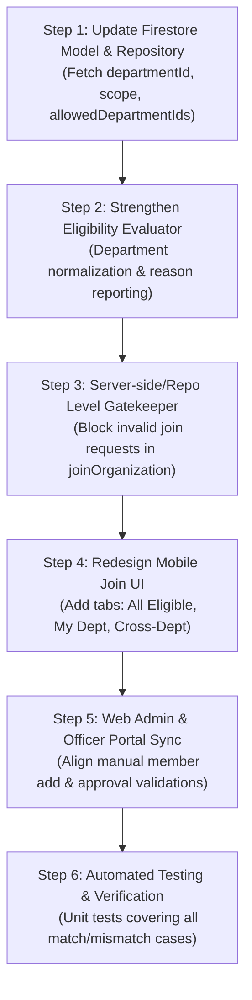

# Implementation Plan: Department-Scoped & Cross-Departmental Organization Membership

> **Status:** Proposed & Ready for Implementation  
> **Target Platforms:** STI Sync Mobile (Flutter) & STI Sync Web (React/TypeScript)  
> **Primary Goal:** Enforce strict organizational governance so students can **only** join departmental organizations matching their enrolled department, while allowing all students to apply to **cross-departmental** organizations.

---

## 1. Executive Summary & Problem Analysis

In STI College, student organizations fall into two distinct institutional categories:
1. **Departmental Academic Societies** (e.g., *Junior Philippine Computer Society [JPCS]* for ICT, *Hospitality Management Society [HMS]* for Tourism/Hospitality). These clubs have mandates, budgets, and activities strictly dedicated to students enrolled in that specific academic department.
2. **Cross-Departmental / Institutional Organizations** (e.g., *Supreme Student Council [SSC]*, *STI Red Cross Youth*, *Peer Facilitators Club*). These organizations operate campus-wide and are open to students from any academic department.

### Current Implementation Gaps Identified in Code:
- **Missing Data Fields in Mobile Fetch**: In `OrganizationRepository.fetchAllOrganizations()`, only `id`, `name`, `acronym`, `logoUrl`, and `description` are retrieved from Firestore. Crucial fields—`departmentId`, `departmentName`, `scope`, and `allowedDepartmentIds`—are omitted.
- **False Fallback in Model**: Because `departmentId` is missing during fetch, `OrganizationModel.fromFirestore` falls back to `departmentId: 'cross-departmental'` and `scope: 'cross-departmental'`, inadvertently making **every** club appear open to all students!
- **Lack of Repository-Level Enforcement**: In `OrganizationRepository.joinOrganization()`, there is no validation check verifying the student's department against the organization before writing a membership document to `/organization_members`.
- **UI/UX Ambiguity**: The `JoinOrganizationSheet` does not provide filtering tabs (e.g., "My Department" vs. "Cross-Departmental"), nor does it explain clearly which department a locked club belongs to.

---

## 2. Business Rules & Access Control Matrix

| Organization Type | `departmentId` in Firestore | Eligible Students | Action on Mobile/Web |
| :--- | :--- | :--- | :--- |
| **Cross-Departmental** | `'cross-departmental'` | **All Active Students** (Any Department) | **Full Access**: Radio button enabled, Green badge *"🌐 Cross-Departmental (Open to All)"*, Apply button active. |
| **Departmental (Matching)** | e.g. `'dept_it'` (matches student) | **Students enrolled in matching department** | **Full Access**: Radio button enabled, Blue badge *"🏢 Your Department (ICT)"*, Apply button active. |
| **Departmental (Mismatched)** | e.g. `'dept_tourism'` (differs from student) | **Non-matching department students** | **LOCKED**: Radio button disabled, Gray card, Red Lock badge *"🔒 Tourism Department Only"*, Alert text: *"Restricted to Tourism students. You belong to ICT."* |

---

## 3. Step-by-Step Implementation Roadmap



---

### Step 1: Fix Data Retrieval in `OrganizationRepository`
**File:** `lib/features/organizations/repositories/organization_repository.dart`

**Changes Required:**
1. In `fetchAllOrganizations()`, include all governance fields:
```dart
return snap.docs.map((doc) {
  final data = doc.data();
  return {
    'id': doc.id,
    'name': (data['name'] as String?) ?? (data['organizationName'] as String?) ?? 'Organization',
    'acronym': (data['acronym'] as String?) ?? (data['code'] as String?) ?? '',
    'logoUrl': (data['logoUrl'] as String?) ?? (data['logo'] as String?),
    'description': (data['description'] as String?) ?? '',
    // CRITICAL: Governance fields
    'departmentId': (data['departmentId'] as String?) ?? (data['department'] as String?) ?? 'cross-departmental',
    'departmentName': (data['departmentName'] as String?) ?? '',
    'scope': (data['scope'] as String?) ?? '',
    'allowedDepartmentIds': data['allowedDepartmentIds'] ?? [],
    'allowedCourseIds': data['allowedCourseIds'] ?? [],
    'status': (data['status'] as String?) ?? 'active',
  };
}).toList();
```

---

### Step 2: Enhance `OrganizationModel` Eligibility Logic
**File:** `lib/features/organizations/models/organization_model.dart`

**Changes Required:**
1. Add `departmentName` to `OrganizationModel`.
2. Enhance `isStudentEligible()` to support:
   - Case-insensitive ID and Name normalization.
   - Robust check against `allowedDepartmentIds`.
   - Structural return type `OrganizationEligibilityResult` providing:
     - `bool isEligible`
     - `String reason`
     - `String badgeLabel`

```dart
class OrganizationEligibilityResult {
  final bool isEligible;
  final String badgeText;
  final String lockExplanation;

  const OrganizationEligibilityResult({
    required this.isEligible,
    required this.badgeText,
    required this.lockExplanation,
  });
}
```

---

### Step 3: Implement Repository Gatekeeping in `joinOrganization()`
**File:** `lib/features/organizations/repositories/organization_repository.dart`

**Changes Required:**
Before adding a document to `/organization_members`:
1. Fetch the organization document `/organizations/{organizationId}`.
2. Parse into `OrganizationModel`.
3. Evaluate eligibility:
```dart
final orgDoc = await _firestore.collection(FirestorePaths.organizations).doc(organizationId).get();
if (!orgDoc.exists) {
  throw Exception('Organization not found.');
}
final org = OrganizationModel.fromFirestore(orgDoc.data()!, orgDoc.id);

if (!org.isStudentEligible(student.departmentId, student.departmentName)) {
  final target = org.departmentName.isNotEmpty ? org.departmentName : 'its designated department';
  throw Exception('Cannot join: This organization is exclusive to students of $target.');
}
```

---

### Step 4: Redesign UI in `JoinOrganizationSheet`
**File:** `lib/features/organizations/widgets/join_organization_sheet.dart`

**Changes Required:**
1. **Category Filter Chips / Tabs**:
   - `All Eligible` (Default view: Shows only orgs student can actually apply to).
   - `My Department` (Filtered to student's academic society).
   - `Cross-Departmental` (Filtered to institutional clubs).
   - `Browse All` (Shows all clubs, with non-eligible ones clearly locked and grayed out).
2. **Visual Badging**:
   - 🌐 **Green Badge**: `Cross-Departmental (Open to All)`
   - 🏢 **Blue Badge**: `My Department (ICT)`
   - 🔒 **Red/Gray Badge**: `Restricted ([Dept Name] Only)`
3. **Lockout Explanation Card**:
   - For locked clubs, show an inline note:  
     *"This club is restricted to students of [Organization Department]. Your enrolled department is [Student Department]."*
4. **Safety Prevention**:
   - The radio selector and card `onTap` are completely disabled if `!isEligible`.
   - The submit button remains disabled unless an eligible organization is selected.

---

### Step 5: Web Admin & Officer Portal Synchronization
**Files in `STI Sync Web`:**
- `src/app/modules/organizations/components/CreateClubModal.tsx`
- `src/app/officer/components/members/AddMemberModal.tsx`
- `src/app/officer/pages/OfficerMembers.tsx`

**Validations to Align:**
1. **Club Creation**:
   - When creating a club, the SAO Admin selects either `Cross-Departmental (Institutional)` or a specific department (e.g., `Information Technology`).
   - Saving writes `departmentId` and denormalized `departmentName`.
2. **Manual Officer Member Add**:
   - When an officer manually adds a student by Student ID in `AddMemberModal.tsx`, validate that the student's department matches the organization's department (unless cross-departmental).
3. **Join Request Approval**:
   - Display a verified department badge on the join request row so officers can immediately confirm the applicant is in their department before clicking "Approve".

---

### Step 6: Automated Testing & Verification Plan

Create unit test file `test/features/organizations/organization_department_eligibility_test.dart`:

```dart
void main() {
  group('Organization Department Scope & Eligibility Tests', () {
    final itStudent = StudentModel(
      departmentId: 'dept_it',
      departmentName: 'Information Technology',
      courseCode: 'BSIT',
      ...
    );

    final crossDeptOrg = OrganizationModel(
      id: 'org_ssc',
      name: 'Supreme Student Council',
      departmentId: 'cross-departmental',
      scope: 'cross-departmental',
      ...
    );

    final itOrg = OrganizationModel(
      id: 'org_jpcs',
      name: 'Junior Philippine Computer Society',
      departmentId: 'dept_it',
      departmentName: 'Information Technology',
      scope: 'departmental',
      ...
    );

    final tourismOrg = OrganizationModel(
      id: 'org_hms',
      name: 'Hospitality Management Society',
      departmentId: 'dept_tourism',
      departmentName: 'Tourism & Hospitality',
      scope: 'departmental',
      ...
    );

    test('IT student can join Cross-Departmental organization', () {
      expect(crossDeptOrg.isStudentEligible(itStudent.departmentId, itStudent.departmentName), isTrue);
    });

    test('IT student can join matching IT Departmental organization', () {
      expect(itOrg.isStudentEligible(itStudent.departmentId, itStudent.departmentName), isTrue);
    });

    test('IT student is BLOCKED from joining Tourism Departmental organization', () {
      expect(tourismOrg.isStudentEligible(itStudent.departmentId, itStudent.departmentName), isFalse);
    });

    test('Repository throws exception when attempting to join mismatched organization', () async {
      // Expect OrganizationRepository.joinOrganization to throw validation exception
    });
  });
}
```

---

## 4. Expected Deliverables & Visual Outcomes

1. **Clean Visual Hierarchy in Mobile**:
   Students no longer see an unorganized list of clubs they cannot join. Eligible clubs appear at the top, clearly tagged.
2. **Institutional Data Integrity**:
   Tourism students cannot accidentally or intentionally submit membership requests to BSIT clubs, protecting dues collection, voter rosters, and attendance records from cross-department contamination.
3. **Defense Presentation Talking Point**:
   > *"STI Sync preserves academic specialization integrity. Departmental clubs like JPCS are strictly ring-fenced to IT students, while institutional organizations like the Supreme Student Council remain open to the entire campus."*
