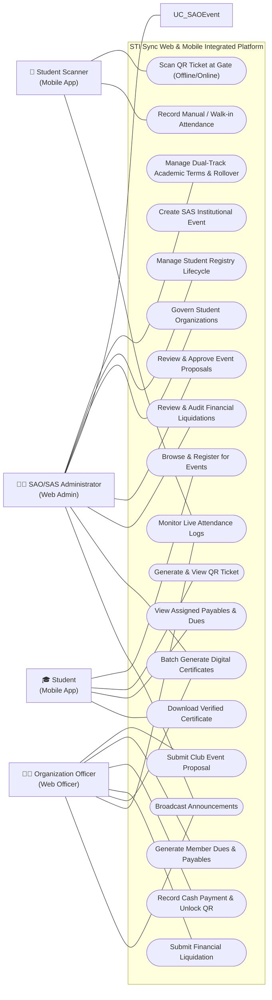
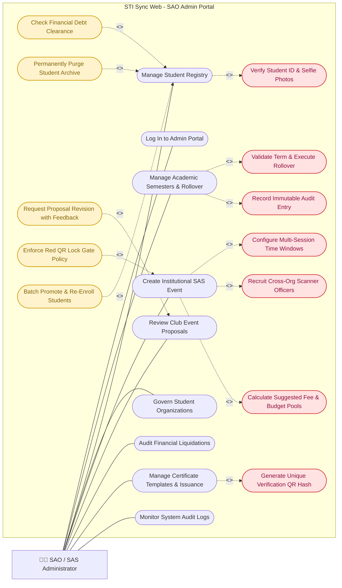
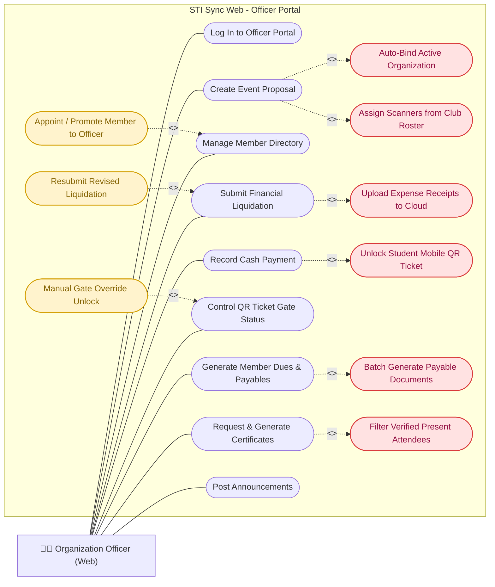
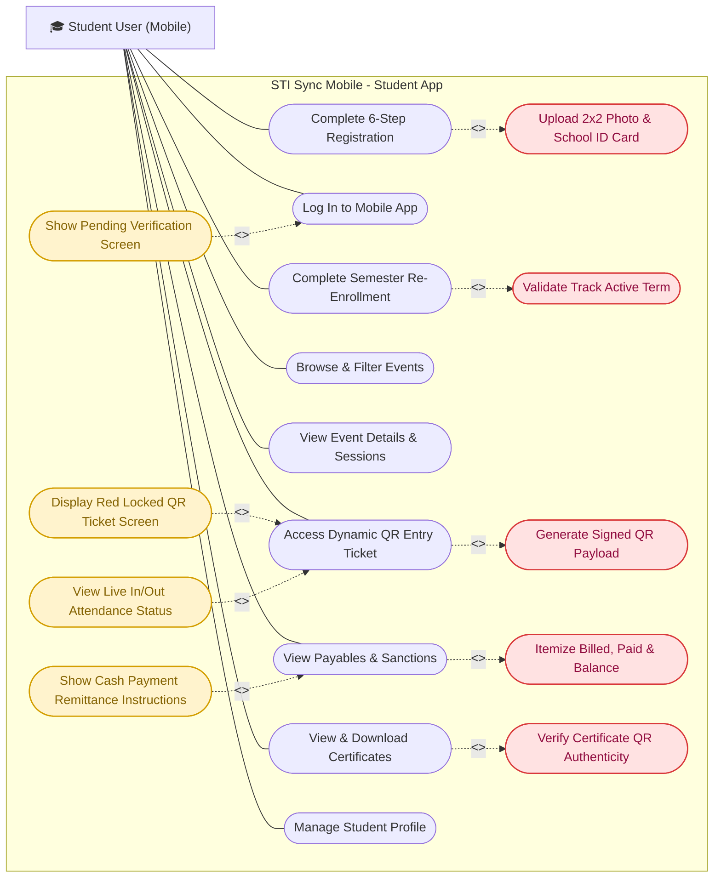
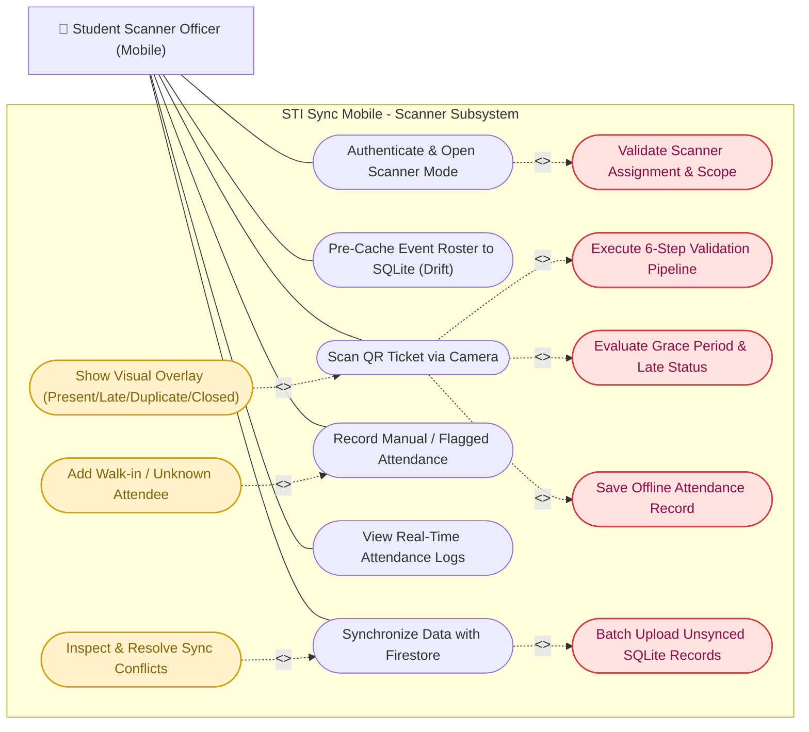

# STI Sync - Comprehensive Use Case Diagrams & Specifications

> **System:** STI Sync Web & Mobile Integrated Platform  
> **Target Audience:** Software Engineering Capstone Defense, System Architects, Quality Assurance & Developers  
> **Reference Model:** UML 2.5 Use Case Standard (Actors, Associations, `<<include>>`, `<<extend>>`, System Boundaries)

---

## 1. Diagram Asset Catalog & Formats Available

All diagrams have been created and exported in **three industry-standard formats** under the [`docs/diagrams/`](file:///c:/VSCODE%20PROJECTS/STI%20SYNC%20WEB%20AND%20MOBILE/docs/diagrams) directory:

| Format | File Extension | How to View & Edit | Best Used For |
| :--- | :--- | :--- | :--- |
| **Draw.io / diagrams.net** | [`.drawio`](file:///c:/VSCODE%20PROJECTS/STI%20SYNC%20WEB%20AND%20MOBILE/docs/diagrams/sti-sync-all-actors.drawio) | Open in VS Code with the *Draw.io Integration* extension or at [app.diagrams.net](https://app.diagrams.net) | **Visual drag-and-drop editing, real arrows, moving nodes, color changes** |
| **Scalable Vector Graphics** | [`.svg`](file:///c:/VSCODE%20PROJECTS/STI%20SYNC%20WEB%20AND%20MOBILE/docs/diagrams/admin-use-case-diagram.svg) | View in any browser, Word document, PowerPoint slide, or PDF reader | **High-resolution crystal-clear vector graphics for Defense & Thesis Papers** |
| **PlantUML** | [`.puml`](file:///c:/VSCODE%20PROJECTS/STI%20SYNC%20WEB%20AND%20MOBILE/docs/diagrams/admin-use-case-diagram.puml) | Open in VS Code with the *PlantUML* extension | **Formal programmatic UML generation & code-level versioning** |

### 📁 Quick File Links

- 🎨 **Master Multi-Tab Draw.io (All 4 Actors):** [`docs/diagrams/sti-sync-all-actors.drawio`](file:///c:/VSCODE%20PROJECTS/STI%20SYNC%20WEB%20AND%20MOBILE/docs/diagrams/sti-sync-all-actors.drawio)
- 🧑‍💼 **SAO Admin Web:** [`admin-use-case-diagram.drawio`](file:///c:/VSCODE%20PROJECTS/STI%20SYNC%20WEB%20AND%20MOBILE/docs/diagrams/admin-use-case-diagram.drawio) | [`admin-use-case-diagram.svg`](file:///c:/VSCODE%20PROJECTS/STI%20SYNC%20WEB%20AND%20MOBILE/docs/diagrams/admin-use-case-diagram.svg) | [`admin-use-case-diagram.puml`](file:///c:/VSCODE%20PROJECTS/STI%20SYNC%20WEB%20AND%20MOBILE/docs/diagrams/admin-use-case-diagram.puml)
- 🧑‍💻 **Officer Web:** [`officer-use-case-diagram.drawio`](file:///c:/VSCODE%20PROJECTS/STI%20SYNC%20WEB%20AND%20MOBILE/docs/diagrams/officer-use-case-diagram.drawio) | [`officer-use-case-diagram.svg`](file:///c:/VSCODE%20PROJECTS/STI%20SYNC%20WEB%20AND%20MOBILE/docs/diagrams/officer-use-case-diagram.svg) | [`officer-use-case-diagram.puml`](file:///c:/VSCODE%20PROJECTS/STI%20SYNC%20WEB%20AND%20MOBILE/docs/diagrams/officer-use-case-diagram.puml)
- 🎓 **Student Mobile:** [`student-use-case-diagram.drawio`](file:///c:/VSCODE%20PROJECTS/STI%20SYNC%20WEB%20AND%20MOBILE/docs/diagrams/student-use-case-diagram.drawio) | [`student-use-case-diagram.svg`](file:///c:/VSCODE%20PROJECTS/STI%20SYNC%20WEB%20AND%20MOBILE/docs/diagrams/student-use-case-diagram.svg) | [`student-use-case-diagram.puml`](file:///c:/VSCODE%20PROJECTS/STI%20SYNC%20WEB%20AND%20MOBILE/docs/diagrams/student-use-case-diagram.puml)
- 📱 **Student Scanner Mobile:** [`scanner-use-case-diagram.drawio`](file:///c:/VSCODE%20PROJECTS/STI%20SYNC%20WEB%20AND%20MOBILE/docs/diagrams/scanner-use-case-diagram.drawio) | [`scanner-use-case-diagram.svg`](file:///c:/VSCODE%20PROJECTS/STI%20SYNC%20WEB%20AND%20MOBILE/docs/diagrams/scanner-use-case-diagram.svg) | [`scanner-use-case-diagram.puml`](file:///c:/VSCODE%20PROJECTS/STI%20SYNC%20WEB%20AND%20MOBILE/docs/diagrams/scanner-use-case-diagram.puml)

---

## 2. Executive Summary & Actor Directory

The **STI Sync** platform is a synchronized institutional event management, gate access control, financial liquidation, and academic lifecycle monitoring system designed for STI College. The system spans across two integrated applications:
1. **STI Sync Web Application** (React 19 + TypeScript + Vite + Tailwind CSS + Firebase Firestore)
2. **STI Sync Mobile Application** (Flutter / Android + Firebase + Drift SQLite Offline Database)

### Primary System Actors

| Actor Icon | Actor Name | Platform | Description & Core Responsibilities |
| :--- | :--- | :--- | :--- |
| 🧑‍💼 | **SAO / SAS Administrator** | Web Admin Portal (`/home/*`) | Head administrator representing Student Affairs & Services. Responsible for dual-track academic period governance, student registry lifecycle, club oversight, institutional SAS event creation, cross-organization scanner assignments, financial liquidation audits, certificate templates, and immutable system audit logs. |
| 🧑‍💻 | **Student Organization Officer** | Web Officer Portal (`/officer/*`) | Duly recognized student leaders managing a specific campus club or academic society. Responsible for event proposals, collecting dues/fees, recording cash payments to unlock mobile QR tickets in real-time, submitting financial liquidations with proof of expense, and issuing event certificates. |
| 🎓 | **Student User** | Mobile App (`lib/features/*`) | Enrolled Senior High School or College students. Responsible for self-registration, profile management, browsing/registering for events, accessing live dynamic QR entry tickets, tracking payables/dues, viewing payment channels, and downloading digital certificates. |
| 📱 | **Student Scanner Officer** | Mobile App - Scanner Mode (`lib/features/scanner/*`) | Assigned student officer conducting gate entry validation. Operates the camera scanner with 6-stage offline validation (event match, session window, duplicate check, grace period evaluation), executes manual/walk-in attendance, and synchronizes SQLite attendance data back to Firebase Firestore. |

---

## 3. Unified Master System Use Case Diagram

The unified diagram illustrates the high-level boundaries and key functional touchpoints across all four actors within the STI Sync ecosystem.



---

## 4. Actor 1: SAO / SAS Administrator (Admin - Web Portal)

The **SAO/SAS Administrator** operates at the top tier of institutional governance. The diagram below details all primary use cases, mandatory sub-processes (`<<include>>`), and conditional extensions (`<<extend>>`).

*Direct File Links: [Open in Draw.io](file:///c:/VSCODE%20PROJECTS/STI%20SYNC%20WEB%20AND%20MOBILE/docs/diagrams/admin-use-case-diagram.drawio) | [Open Vector SVG](file:///c:/VSCODE%20PROJECTS/STI%20SYNC%20WEB%20AND%20MOBILE/docs/diagrams/admin-use-case-diagram.svg) | [Open PlantUML](file:///c:/VSCODE%20PROJECTS/STI%20SYNC%20WEB%20AND%20MOBILE/docs/diagrams/admin-use-case-diagram.puml)*

### 4.1 Administrator Use Case Diagram



### 4.2 Administrator Use Case Table & Details

| Use Case ID | Use Case Name | Stereotype / Relation | Description |
| :--- | :--- | :--- | :--- |
| **UC-ADM-01** | **Log In to Admin Portal** | Base Use Case | SAO Administrator authenticates using email and password with Firebase Authentication. |
| **UC-ADM-02** | **Manage Academic Semesters & Rollover** | Base Use Case | Sets up College semesters and SHS trimesters, manages active status, and triggers track-specific academic rollover. |
| &boxur; *Inc-01* | *Validate Term & Execute Rollover* | `<<include>>` | Validates target upcoming terms, closes the active period, and sets new active terms per academic track. |
| &boxur; *Inc-02* | *Record Immutable Audit Entry* | `<<include>>` | Automatically writes timestamped records into `/audit_logs` for every administrative state change. |
| **UC-ADM-03** | **Manage Student Registry** | Base Use Case | Comprehensive student registry dashboard (Active, Inactive, Archived, Pending Verification). |
| &boxur; *Inc-03* | *Verify Student ID & Selfie Photos* | `<<include>>` | Compares uploaded registration selfie photo side-by-side with official STI ID card before granting active status. |
| &boxur; *Ext-01* | *Check Financial Debt Clearance* | `<<extend>>` | Pre-flight validation blocking archival if student has unpaid club/event payables or fines. |
| &boxur; *Ext-02* | *Permanently Purge Student Archive* | `<<extend>>` | Deletes student account with double-confirmation guard while preserving historical financial ledger entries. |
| &boxur; *Ext-03* | *Batch Promote & Re-Enroll Students* | `<<extend>>` | Promotes students to the next grade/year level (e.g., Grade 11 &rarr; 12, 1st Year &rarr; 2nd Year) based on active periods. |
| **UC-ADM-04** | **Govern Student Organizations** | Base Use Case | Creates organizations, approves charters, appoints advisers, and manages active/probationary statuses. |
| **UC-ADM-05** | **Create Institutional SAS Event** | Base Use Case | 7-step wizard creating campus-wide SAS events decoupled from student club ledgers. |
| &boxur; *Inc-04* | *Configure Multi-Session Time Windows* | `<<include>>` | Defines date, time-in, time-out, grace period (minutes), and late thresholds per session. |
| &boxur; *Inc-05* | *Recruit Cross-Org Scanner Officers* | `<<include>>` | Assigns active student officers from any recognized club to scan attendance with granular permissions. |
| &boxur; *Inc-06* | *Calculate Suggested Fee & Budget Pools* | `<<include>>` | Distributes institutional event budget across expected student participants. |
| &boxur; *Ext-04* | *Enforce Red QR Lock Gate Policy* | `<<extend>>` | Locks mobile QR ticket for students who have not completed payment for fee-based events. |
| **UC-ADM-06** | **Review Club Event Proposals** | Base Use Case | Reviews submitted club event proposals, evaluates compliance docs, budget items, and approves or rejects. |
| &boxur; *Ext-05* | *Request Proposal Revision with Feedback* | `<<extend>>` | Returns proposal to student officers with itemized revision notes for resubmission. |
| **UC-ADM-07** | **Audit Financial Liquidations** | Base Use Case | Audits submitted post-event liquidations against receipts, checks variances, and approves balance reconciliations. |
| **UC-ADM-08** | **Manage Certificate Templates & Issuance** | Base Use Case | Drag-and-drop canvas template builder, bulk certificate generation, and batch export (PDF/PNG). |
| &boxur; *Inc-07* | *Generate Unique Verification QR Hash* | `<<include>>` | Embeds a cryptographic verification code and QR code on each issued certificate for authenticity validation. |
| **UC-ADM-09** | **Monitor System Audit Logs** | Base Use Case | Real-time, tamper-resistant system activity stream tracking logins, approvals, data changes, and deletions. |

---

## 5. Actor 2: Student Organization Officer (Officer - Web Portal)

The **Student Organization Officer** oversees student club operations, financial collections, event proposals, and membership records.

*Direct File Links: [Open in Draw.io](file:///c:/VSCODE%20PROJECTS/STI%20SYNC%20WEB%20AND%20MOBILE/docs/diagrams/officer-use-case-diagram.drawio) | [Open Vector SVG](file:///c:/VSCODE%20PROJECTS/STI%20SYNC%20WEB%20AND%20MOBILE/docs/diagrams/officer-use-case-diagram.svg) | [Open PlantUML](file:///c:/VSCODE%20PROJECTS/STI%20SYNC%20WEB%20AND%20MOBILE/docs/diagrams/officer-use-case-diagram.puml)*

### 5.1 Organization Officer Use Case Diagram



### 5.2 Organization Officer Use Case Table & Details

| Use Case ID | Use Case Name | Stereotype / Relation | Description |
| :--- | :--- | :--- | :--- |
| **UC-OFF-01** | **Log In to Officer Portal** | Base Use Case | Authenticates and establishes the officer's authorized organization context. |
| **UC-OFF-02** | **Create Event Proposal** | Base Use Case | 7-step wizard to propose a club activity, including schedule, budget, target audience, and staff. |
| &boxur; *Inc-01* | *Auto-Bind Active Organization* | `<<include>>` | Automatically binds the proposal to the officer's organization ID with locked identity badges. |
| &boxur; *Inc-02* | *Assign Scanners from Club Roster* | `<<include>>` | Selects active club officers to serve as gate scanners for the event sessions. |
| **UC-OFF-03** | **Manage Member Directory** | Base Use Case | Views enrolled club members, dues balances, contact details, and attendance history. |
| &boxur; *Ext-01* | *Appoint / Promote Member to Officer* | `<<extend>>` | Grants leadership roles (President, VP, Treasurer, Auditor, etc.) to qualified members. |
| **UC-OFF-04** | **Generate Member Dues & Payables** | Base Use Case | Sets semester club dues or event participation fees for targeted member cohorts. |
| &boxur; *Inc-03* | *Batch Generate Payable Documents* | `<<include>>` | Generates itemized `/payables` records across all target students in Firestore. |
| **UC-OFF-05** | **Record Cash Payment** | Base Use Case | Records over-the-counter cash remittance from a student for dues, fees, or fines. |
| &boxur; *Inc-04* | *Unlock Student Mobile QR Ticket* | `<<include>>` | Instantly updates the student's payable status to `paid` and unlocks their mobile QR gate ticket in real time. |
| **UC-OFF-06** | **Control QR Ticket Gate Status** | Base Use Case | Monitors real-time gate entry eligibility and payment compliance. |
| &boxur; *Ext-02* | *Manual Gate Override Unlock* | `<<extend>>` | Grants manual entry override for authorized exception cases (e.g., promissory notes). |
| **UC-OFF-07** | **Submit Financial Liquidation** | Base Use Case | Submits financial reconciliation report comparing budgeted funds against actual expenditures. |
| &boxur; *Inc-05* | *Upload Expense Receipts to Cloud* | `<<include>>` | Securely uploads official receipts, invoices, and disbursement proofs to Cloudinary. |
| &boxur; *Ext-03* | *Resubmit Revised Liquidation* | `<<extend>>` | Updates receipt attachments and expense rows following SAO Admin audit comments. |
| **UC-OFF-08** | **Request & Generate Certificates** | Base Use Case | Generates e-certificates for verified attendees of completed club events. |
| &boxur; *Inc-06* | *Filter Verified Present Attendees* | `<<include>>` | Pulls verified attendance logs to ensure only students marked `Present` or `Late` receive certificates. |
| **UC-OFF-09** | **Post Announcements** | Base Use Case | Broadcasts club announcements, event reminders, and meeting notices to members. |

---

## 6. Actor 3: Student User (Student - Mobile App)

The **Student User** interacts with the system via the native Flutter mobile app to engage in campus life, track attendance, manage financial responsibilities, and access verified credentials.

*Direct File Links: [Open in Draw.io](file:///c:/VSCODE%20PROJECTS/STI%20SYNC%20WEB%20AND%20MOBILE/docs/diagrams/student-use-case-diagram.drawio) | [Open Vector SVG](file:///c:/VSCODE%20PROJECTS/STI%20SYNC%20WEB%20AND%20MOBILE/docs/diagrams/student-use-case-diagram.svg) | [Open PlantUML](file:///c:/VSCODE%20PROJECTS/STI%20SYNC%20WEB%20AND%20MOBILE/docs/diagrams/student-use-case-diagram.puml)*

### 6.1 Student Mobile Use Case Diagram



### 6.2 Student Mobile Use Case Table & Details

| Use Case ID | Use Case Name | Stereotype / Relation | Description |
| :--- | :--- | :--- | :--- |
| **UC-STU-01** | **Complete 6-Step Registration** | Base Use Case | Guided mobile registration flow capturing personal, academic, and credential details. |
| &boxur; *Inc-01* | *Upload 2x2 Photo & School ID Card* | `<<include>>` | Uploads live front-facing portrait and physical STI student ID photo to Cloudinary. |
| **UC-STU-02** | **Log In to Mobile App** | Base Use Case | Authenticates with 11-digit Student ID / institutional email and password. |
| &boxur; *Ext-01* | *Show Pending Verification Screen* | `<<extend>>` | Displays account status countdown while awaiting SAO Admin visual ID approval. |
| **UC-STU-03** | **Complete Semester Re-Enrollment** | Base Use Case | Prompts student at start of term to confirm current track, program, year level, and section. |
| &boxur; *Inc-02* | *Validate Track Active Term* | `<<include>>` | Verifies against active College semester or SHS trimester in Firestore. |
| **UC-STU-04** | **Browse & Filter Events** | Base Use Case | Explores campus activities filtered by eligibility (Open to All, Course-Specific, Org-Only). |
| **UC-STU-05** | **View Event Details & Sessions** | Base Use Case | Reviews schedule, venue, session windows (Time-In/Out), grace periods, and rules. |
| **UC-STU-06** | **Access Dynamic QR Entry Ticket** | Base Use Case | Displays personal, tamper-evident QR code ticket for gate check-in at event venue. |
| &boxur; *Inc-03* | *Generate Signed QR Payload* | `<<include>>` | Constructs structured JSON payload: `{ eventId, studentId, studentAuthUid, timestamp }`. |
| &boxur; *Ext-02* | *Display Red Locked QR Ticket Screen* | `<<extend>>` | Replaces QR code with a locked warning badge if required event fee is unpaid. |
| &boxur; *Ext-03* | *View Live In/Out Attendance Status* | `<<extend>>` | Displays real-time check-in time, gate status (Present/Late), and time-out confirmation. |
| **UC-STU-07** | **View Payables & Sanctions** | Base Use Case | Financial dashboard tracking org dues, event registration fees, and absence fines. |
| &boxur; *Inc-04* | *Itemize Billed, Paid & Balance* | `<<include>>` | Shows complete financial breakdown and historical payment receipts. |
| &boxur; *Ext-04* | *Show Cash Payment Remittance Instructions* | `<<extend>>` | Informs student of official officer remittance desks and cash collection schedules. |
| **UC-STU-08** | **View & Download Certificates** | Base Use Case | Digital repository of verified certificates of participation and achievement. |
| &boxur; *Inc-05* | *Verify Certificate QR Authenticity* | `<<include>>` | Allows scanning/verifying certificate hash to confirm legitimacy against SAO records. |
| **UC-STU-09** | **Manage Student Profile** | Base Use Case | Updates contact details, emergency contacts, profile photo, and password. |

---

## 7. Actor 4: Student Scanner Officer (Scanner - Mobile App)

The **Student Scanner Officer** operates the mobile app in specialized **Scanner Mode** to facilitate rapid gate entry validation during campus events. The scanner operates with robust offline database synchronization.

*Direct File Links: [Open in Draw.io](file:///c:/VSCODE%20PROJECTS/STI%20SYNC%20WEB%20AND%20MOBILE/docs/diagrams/scanner-use-case-diagram.drawio) | [Open Vector SVG](file:///c:/VSCODE%20PROJECTS/STI%20SYNC%20WEB%20AND%20MOBILE/docs/diagrams/scanner-use-case-diagram.svg) | [Open PlantUML](file:///c:/VSCODE%20PROJECTS/STI%20SYNC%20WEB%20AND%20MOBILE/docs/diagrams/scanner-use-case-diagram.puml)*

### 7.1 Scanner Officer Use Case Diagram



### 7.2 Scanner Officer Use Case Table & 6-Stage Validation Pipeline

| Use Case ID | Use Case Name | Stereotype / Relation | Description |
| :--- | :--- | :--- | :--- |
| **UC-SCN-01** | **Authenticate & Open Scanner Mode** | Base Use Case | Switches from standard student profile to authorized Scanner Mode interface. |
| &boxur; *Inc-01* | *Validate Scanner Assignment & Scope* | `<<include>>` | Verifies officer is actively assigned as scanner for the selected event and session. |
| **UC-SCN-02** | **Pre-Cache Event Roster to SQLite** | Base Use Case | Downloads event participant roster, session windows, and rules into local Drift SQLite database. |
| **UC-SCN-03** | **Scan QR Ticket via Camera** | Base Use Case | Continuously reads student QR tickets using mobile device camera. |
| &boxur; *Inc-02* | *Execute 6-Step Validation Pipeline* | `<<include>>` | Executes sequential algorithmic validation: format check, event match, window open/close check, roster registration check, duplicate scan check. |
| &boxur; *Inc-03* | *Evaluate Grace Period & Late Status* | `<<include>>` | Computes scan time vs `sessionStartTime + gracePeriodMinutes`: marks `Present` (On-Time) or `Late`. |
| &boxur; *Inc-04* | *Save Offline Attendance Record* | `<<include>>` | Writes attendance record with timestamp and sync flag directly to SQLite. |
| &boxur; *Ext-01* | *Show Visual Overlay* | `<<extend>>` | Displays colored visual banner: Green (Present), Orange (Late), Red (Duplicate / Window Closed / Not Registered). |
| **UC-SCN-04** | **Record Manual / Flagged Attendance** | Base Use Case | Handles students unable to scan QR code (e.g., dead battery or damaged screen). |
| &boxur; *Ext-02* | *Add Walk-in / Unknown Attendee* | `<<extend>>` | Directly logs walk-in participants not present in the original pre-cached roster. |
| **UC-SCN-05** | **View Real-Time Attendance Logs** | Base Use Case | Chronological feed showing total scans, on-time count, late count, and gate status. |
| **UC-SCN-06** | **Synchronize Data with Firestore** | Base Use Case | Syncs offline Drift records to Cloud Firestore automatically or upon manual trigger. |
| &boxur; *Inc-05* | *Batch Upload Unsynced SQLite Records* | `<<include>>` | Batches unsynced records into Firestore writes and updates local sync status. |
| &boxur; *Ext-03* | *Inspect & Resolve Sync Conflicts* | `<<extend>>` | Handles duplicate or out-of-order timestamp conflicts between offline devices. |

---

## 8. Cross-Actor Relational Matrix (Entity Life Cycle Traceability)

The table below demonstrates how shared core business entities transition across the four system actors:

| System Entity | 🧑‍💼 SAO Admin (Web) | 🧑‍💻 Officer (Web) | 🎓 Student (Mobile) | 📱 Student Scanner (Mobile) |
| :--- | :--- | :--- | :--- | :--- |
| **Academic Semesters & Rollover** | Creates, configures terms, executes rollover, audits history | Read-only term context | Validates re-enrollment, binds track/section | Reads active term for event eligibility |
| **Student Accounts & Registry** | Visual ID verification, archival clearance, permanent deletion | Views club members, assigns officer permissions | Registers account, updates profile, re-enrolls | Validates scanned student identity against roster |
| **Events & Proposals** | Creates SAS events, recruits cross-org scanners, approves/rejects club proposals | Drafts/submits proposals, assigns club scanners | Browses events, checks eligibility, confirms participation | Pre-caches event roster, validates gate session windows |
| **Payables & Dues** | Configures suggested fees, audits financial ledgers | Generates member dues, records cash payments, unlocks QR gates | Views assigned dues/fines, checks payment channels | Reads unlocked QR ticket status at event gate |
| **QR Gate Tickets** | Sets QR lock policy on fee-based events | Toggles QR gate unlock status upon cash payment | Generates dynamic QR ticket on mobile screen | Scans QR ticket, evaluates grace period & late status |
| **Attendance Records** | Monitors global attendance analytics & logs | Monitors real-time club attendance stream | Views personal attendance status & check-in timestamps | Captures camera/manual scans, caches to SQLite, syncs to cloud |
| **Financial Liquidations** | Audits liquidation reports, verifies receipts, approves/rejects | Submits post-event expense reports & Cloudinary receipts | N/A | N/A |
| **Digital Certificates** | Designs canvas templates, batch generates & exports certificates | Selects approved templates, issues certificates to present attendees | Previews & downloads verified certificate with QR authenticity | N/A |

---

## 9. Detailed Use Case Specifications (Selected Core Workflows)

### 9.1 Specification: UC-SCN-03 - Execute 6-Step Gate Attendance QR Validation

```
Use Case ID:       UC-SCN-03
Use Case Name:     Execute 6-Step Gate Attendance QR Validation
Primary Actor:     Student Scanner Officer (Mobile)
Secondary Actor:   Student User (Presenting QR Ticket)
Preconditions:     1. Scanner Officer is logged in and assigned to active event session.
                   2. Event roster and validation rules are downloaded to local Drift SQLite database.
                   3. Student presents mobile QR ticket.

Trigger:           Scanner Officer points device camera at student's QR code.

Main Flow (6 Sequential Validations):
  1. Payload Structure Check:
     - Scanner decodes QR JSON payload: { eventId, studentId, studentAuthUid, generatedAt }.
     - Validates all mandatory fields exist.
  2. Event Match Validation:
     - Checks if payload qrEventId == activeEventId.
  3. Attendance Window Validation:
     - Checks if current time is within [timeInOpen, timeInClose] or [timeOutOpen, timeOutClose].
  4. Participant Eligibility Check:
     - Queries local SQLite cached_participants table for studentAuthUid.
  5. Duplicate Check:
     - Queries local SQLite offline_attendance for existing (studentId, sessionId, gateType) record.
  6. Grace Period & Late Status Calculation:
     - If currentTime <= sessionStartTime + gracePeriodMinutes -> Status = 'Present' (On-Time).
     - If currentTime > sessionStartTime + gracePeriodMinutes -> Status = 'Late'.
  7. Local Record Persistence:
     - Inserts record into offline_attendance SQLite table with syncStatus = 'PENDING'.
  8. Visual Feedback:
     - Displays full-screen colored result overlay with student name, ID, status badge, and audio chime.

Extensions (Exceptions):
  1a. Invalid Payload: Displays Red "Invalid QR Format" overlay. Scan dismissed.
  2a. Wrong Event: Displays Red "Wrong Event QR Code" overlay. Scan dismissed.
  3a. Window Not Open: Displays Red "Time-In Opens at [time]" overlay. Scan dismissed.
  3b. Window Closed: Displays Red "Time-In Window Closed at [time]" overlay. Scan dismissed.
  4a. Not in Roster: Displays Red "Student Not Registered" overlay. Prompts for manual entry if allowed.
  5a. Duplicate Scan: Displays Red "Already Scanned at [time]" overlay with prior timestamp.

Postconditions:    Attendance record is saved to SQLite, live log feed updates, and background sync worker queued.
```

---

### 9.2 Specification: UC-ADM-05 - Create Institutional SAS Event

```
Use Case ID:       UC-ADM-05
Use Case Name:     Create Institutional SAS Event (SAO Admin)
Primary Actor:     SAO / SAS Administrator (Web)
Preconditions:     Administrator is authenticated with SAO Admin credentials.

Trigger:           Administrator clicks "Create Event (SAO)" button in Event Approvals view.

Main Flow (7-Step Wizard):
  1. Step 1 - Event Identity: Admin enters title, category, description, and uploads event banner.
  2. Step 2 - Schedule & Multi-Sessions: Admin sets academic term, venue, and defines 1 to N sessions.
     - Sets session start, end, Time-In open/close, Time-Out open/close, and grace period minutes.
  3. Step 3 - Target Cohorts: Admin sets target grade levels, college programs, or campus-wide scope.
  4. Step 4 - Staff & Cross-Org Scanners: Admin searches and recruits active officers across any club.
     - Configures granular permissions (Check-In, Check-Out, Manual Attendance, View Logs).
  5. Step 5 - Budget & Payables Calculator: Admin configures SAS institutional funding line items.
     - Optionally toggles Student Payable fee, auto-calculating suggested fee based on participant quota.
  6. Step 6 - Compliance Documents: Admin uploads institutional authorization letters and memos.
  7. Step 7 - Review & Publish: Admin reviews consolidated preview and clicks "Create & Publish Event".

Extensions:
  5a. Payables Enabled: Red QR Lock gate policy is enabled for all target students until fee is paid.

Postconditions:    Event document created in /events, target student payables generated in /payables,
                   and scanner assignments saved in /scanner_assignments.
```

---

### 9.3 Specification: UC-OFF-05 - Record Cash Payment & Unlock Mobile QR Ticket

```
Use Case ID:       UC-OFF-05
Use Case Name:     Record Cash Payment & Unlock Mobile QR Ticket
Primary Actor:     Student Organization Officer (Web)
Secondary Actor:   Student User (Paying Cash)
Preconditions:     Officer is authenticated in Officer Portal with access to organization payables.

Trigger:           Student remits cash payment to officer, and officer clicks "Record Payment".

Main Flow:
  1. Officer navigates to Event Payables Roster or Organization Dues Ledger.
  2. Officer searches student by name or 11-digit Student ID.
  3. Officer clicks "Record Payment" to open the payment modal.
  4. Officer enters cash amount received, payment date, and optional receipt reference.
  5. Officer clicks "Confirm & Unlock QR Ticket".
  6. System updates /payables document in Firestore:
     - Sets paidAmount += enteredAmount.
     - If paidAmount >= assignedAmount -> sets status = 'paid', isLocked = false.
  7. Real-time snapshot triggers instant unlock on the student's mobile device screen.

Postconditions:    Payable balance is updated, transaction logged in audit trail, and student mobile QR ticket unlocked.
```

---

## 10. Defense & Architecture Quick-Reference

- **UML Standard Compliancy:** Diagrams strictly use standard UML notations: Actors (Stick Figures / Nodes), Solid Association lines, `<<include>>` for mandatory subroutines, `<<extend>>` for optional conditional branches, and clear System Boundaries.
- **Offline First Design:** Scanner mode functions autonomously with SQLite (Drift) without waiting for cloud network responses, preventing gate bottlenecks during peak entry rush.
- **Financial & Attendance Decoupling:** SAS Admin institutional events are decoupled from club ledgers, while club events enforce strictly scoped officer payment recording and QR gate unlocking.
